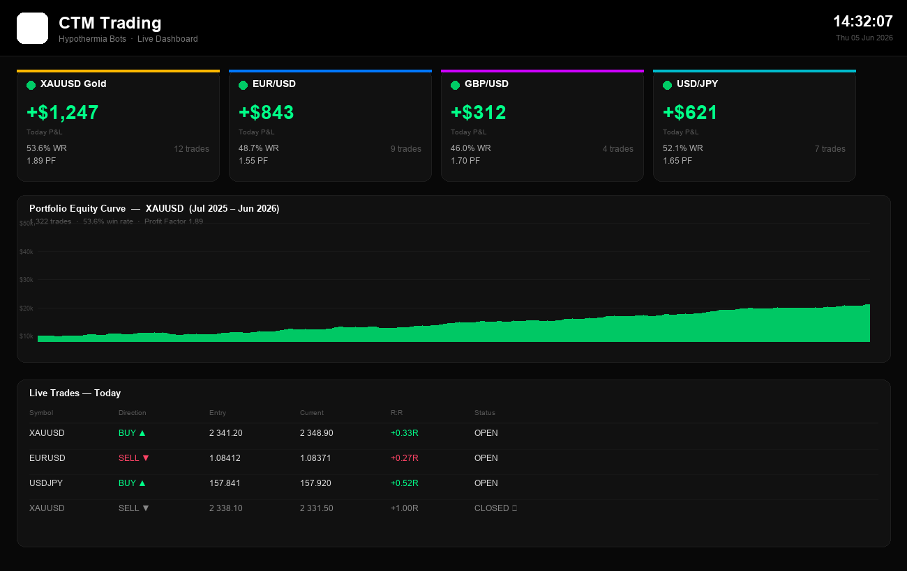
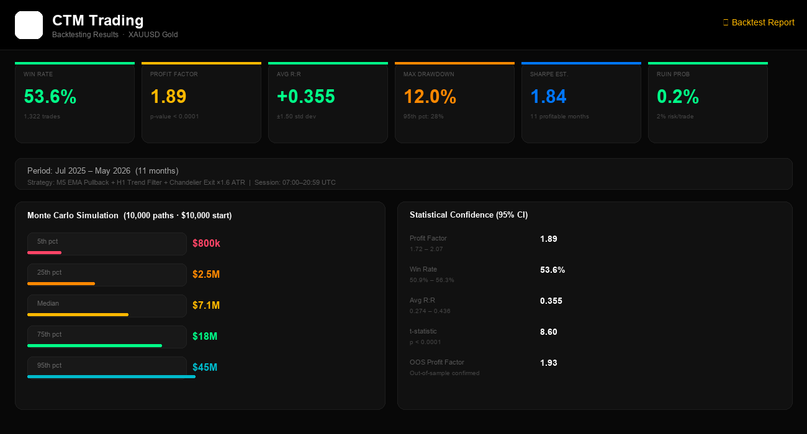

# Hypothermia Trading Bot

> Algorithmic trading system for XAU/USD (Gold) and Deriv synthetic indices — EMA + ATR multi-timeframe strategy with a live Streamlit monitoring dashboard.

[](https://python.org)
[](https://streamlit.io)
[](https://plotly.com)
[](https://api.deriv.com)

---

## Demo


---

## Screenshots

### Live Dashboard


### Trade Chart with Signals


### Backtest Results


---

## About

Hypothermia connects to the Deriv API via WebSockets, executes trades based on EMA + ATR strategy rules, and streams real-time performance data to a Streamlit dashboard.

**Supported instruments:**
- **XAU/USD** — Gold spot (M5 + H1 multi-timeframe strategy)
- **Boom 1000** — Deriv synthetic index
- **Crash 1000** — Deriv synthetic index

---

## Strategy (XAU/USD)

Multi-timeframe approach with dynamic risk sizing:

| Component | Detail |
|-----------|--------|
| Trend filter | H1 EMA-21 determines directional bias |
| Entry trigger | M5 EMA-50 crossover in trend direction |
| ATR zones | Dynamic support/resistance zones |
| Exit | Chandelier stop tiers — multi-level ATR trailing stop |
| Risk sizing | Per-trade ATR-based sizing, not fixed pip values |
| Session | Configurable window (default: London/NY overlap) |

---

## Features

- Live WebSocket connection to Deriv API
- Real-time trade execution and position management
- Streamlit dashboard — live PnL, trade log, chart overlays
- Full backtesting engine for strategy validation
- Parameter sensitivity sweeps
- Portfolio-level risk analysis
- Commodity data fetcher for external price feeds

---

## Project Structure

```
hypothermia-bot/
├── xau_bot.py               # Main XAU/USD bot
├── xau_strategy.py          # Signal generation (EMA, ATR, chandelier)
├── xau_config.py            # Strategy parameters
├── deriv_boom1000_bot.py    # Boom 1000 bot
├── deriv_crash1000_bot.py   # Crash 1000 bot
├── dashboard.py             # Streamlit live dashboard
├── commodity_backtest.py    # Backtest engine
├── frequency_backtest.py    # Frequency-based backtest
├── parameter_sensitivity.py # Parameter sweeps
├── portfolio_risk.py        # Portfolio risk analysis
├── risk_comparison.py       # Risk model comparison
├── fetch_commodity_data.py  # External data fetcher
├── screenshots/             # README screenshots
├── data/                    # Historical price data
└── archive/                 # Past backtest results
```

---

## Setup

### Prerequisites
- Python 3.11+
- Deriv account with API token

### Install

```bash
git clone https://github.com/CypTynash/hypothermia-bot.git
cd hypothermia-bot
python -m venv venv
source venv/bin/activate        # Windows: venv\Scripts\activate
pip install -r requirements.txt
```

### Configure

Create a `.env` file:

```env
DERIV_API_TOKEN=your_api_token_here
DERIV_APP_ID=your_app_id_here
```

### Run

```bash
# Live bot
python xau_bot.py

# Monitoring dashboard
streamlit run dashboard.py
```

---

## Dependencies

| Package | Purpose |
|---------|---------|
| `pandas` | OHLC data processing |
| `numpy` | EMA, ATR calculations |
| `websockets` | Deriv API connection |
| `streamlit` | Live dashboard |
| `plotly` | Interactive charts |
| `python-dotenv` | Environment config |

---

## Disclaimer

For educational and research purposes. Trading carries significant risk. Past performance does not guarantee future results.

---

## License

MIT
